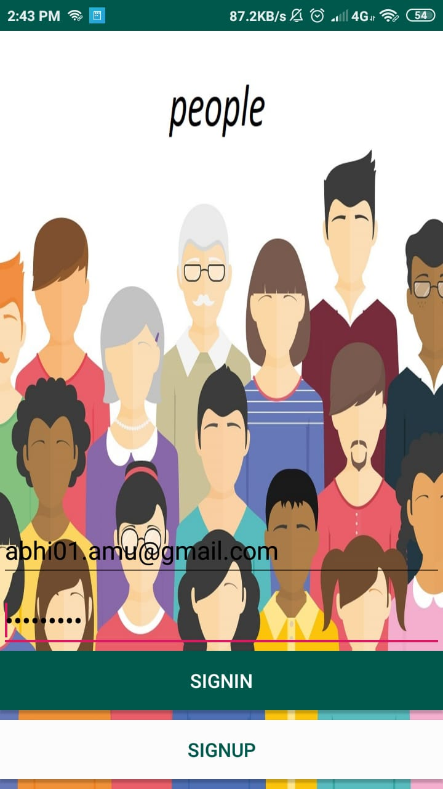
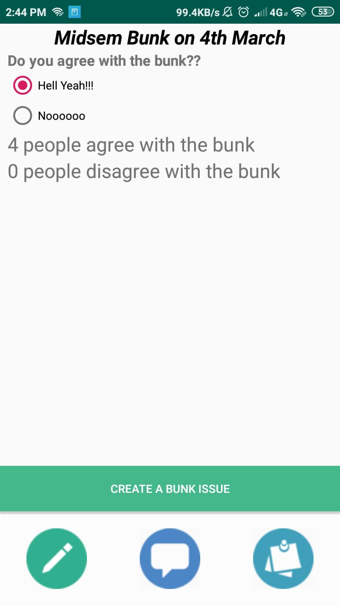
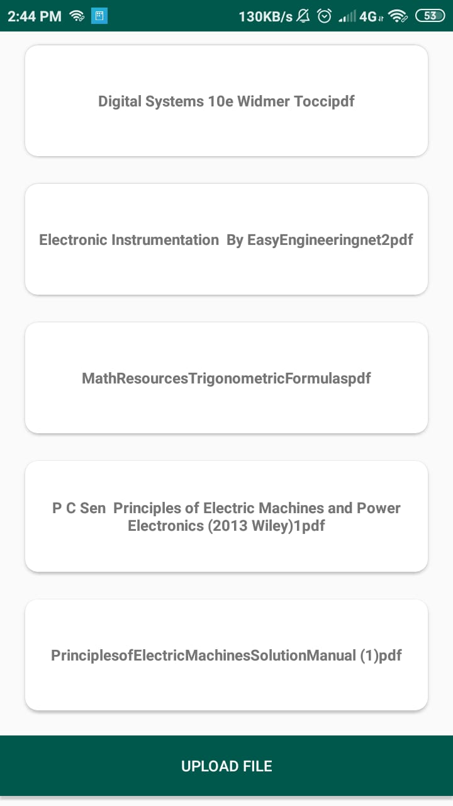
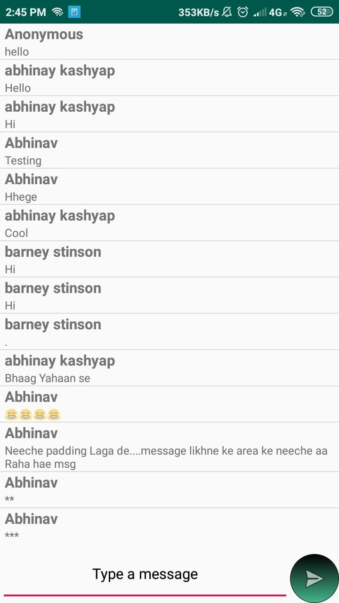

# People

## Quick Insight
An Android application that serves as a platform where students of one class can share important documents, class notes. The app also has a group chat feature where students can discuss about the class activities. The app also serve as a platform where all the students can vote for the bunk.  

## Features
- A Login Activity to ensure only Authentic Users use the app - Implemented using Firebase Authentication. 
- On clicking SignUp button on Login Activity takes the user to another user where they can create a new account. 
- Any user can create a new issue for the bunk and can vote for the issue that is already been posted by other user. 
- A user can upload any document and can also download any document that is uploaded by other users. 
- A user can discuss any issue with the group in the group chat activity. 

## Screenshots

| SignIn_Activity                                                        | SignUp_Activity                                                        | Bunk_Activity                                                        |
| ---------------------------------------------------------------------- | ---------------------------------------------------------------------- | -------------------------------------------------------------------- |
|  |  |  |

| Document_Sharing_Activity                                                       | Group_Chat_Activity                                                  |
| ------------------------------------------------------------------------------- | -------------------------------------------------------------------- |
|  |  |
