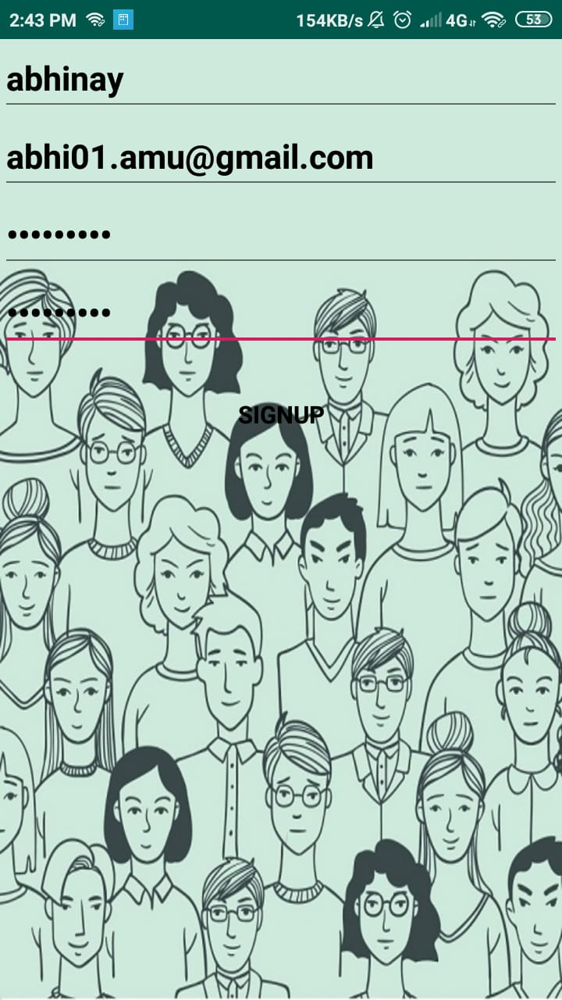

# People

## Quick Insight
An Android application that serves as a platform where students of one class can share important documents, class notes. The app also has a group chat feature where students can discuss about the class activities. The app also serve as a platform where all the students can vote for the bunk.  

<h2>Screenshots</h2>

| SignIn_Activity                                                        | SignUp_Activity                                                        | Bunk_Activity                                                        |
| ---------------------------------------------------------------------- | ---------------------------------------------------------------------- | -------------------------------------------------------------------- |
|  |  |  |

| Document_Sharing_Activity                                                       | Group_Chat_Activity                                                  |
| ------------------------------------------------------------------------------- | -------------------------------------------------------------------- |
|  |  |
